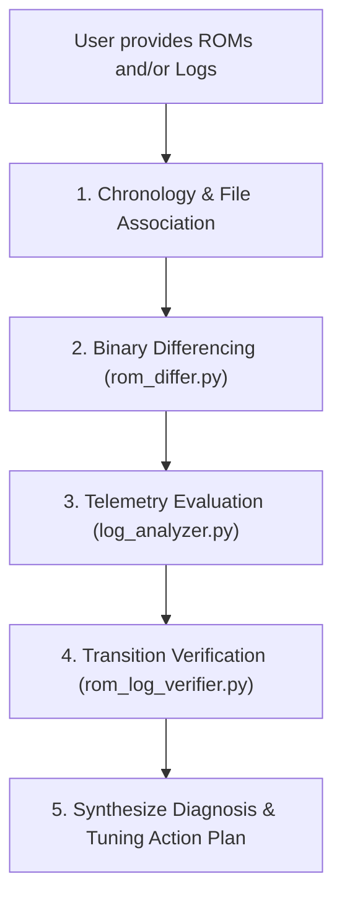

# Mitsubishi Evolution X (4B11T) Tuning & Telemetry Suite

A specialized agentic skill and tool suite for analyzing, diffing, simulating, and validating calibration ROMs and EvoScan datalogs for the Mitsubishi Lancer Evolution X platform.

## Platform Context & Hardware

- **Vehicle**: 2013 Mitsubishi Lancer Evolution X (USDM 5MT)
- **Engine**: 2.0L 4B11T DOHC MIVEC (1,998 cc, 86.0 mm bore x 86.0 mm stroke)
- **ECU**: Renesas M32186F8 (M32R RISC core)
- **Base ROM ID**: `59580004` (USDM 2013 5MT)
- **Patched ROM ID**: `59580304` (TephraMOD v3 + RAX Fast Logging)
- **Induction**: Precision 8474 turbocharger, Full Race 3.5" intake pipe
- **Fuel System**: Injector Dynamics ID1300x, 94 octane pump gas
- **Valvetrain**: GSC S2 camshafts with upgraded valve springs
- **Workspace Paths**:
  - LogChopper Repo: `/Users/steven/go/github.com/LogChopper/`
  - Evoman Drive: `/Users/steven/Library/CloudStorage/GoogleDrive-stevenjohnston.ca@gmail.com/My Drive/Evoman/`
  - Toolkit: `tuning_tools/` (available in both workspaces)

---

## 1. Quick Reference: Memory Map & Binary Structure

All tools and memory references use standard `.srf` or `.bin` offsets.
> [!IMPORTANT]
> `.srf` (Secure ROM Format) files contain a **328-byte (`0x148`)** metadata header before the raw 1MB/2MB flash image.
> `File Offset = 328 + ROM Memory Address`.

Detailed JSON memory specifications:
[`tuning_tools/references/ecu_memory_map.json`](file:///Users/steven/Library/CloudStorage/GoogleDrive-stevenjohnston.ca@gmail.com/My%20Drive/Evoman/tuning_tools/references/ecu_memory_map.json)

| Calibration Table | ROM Address | File Offset (.srf) | Dimensions | Element Format & Scaling | EcuFlash Units |
| :--- | :---: | :---: | :---: | :---: | :---: |
| **MAF Scaling Horizontal** | `0x5757a` | `0x576c2` | 130 cells | `uint16` (big-endian), `x / 100.0` | g/s |
| **MAF Volts Axis** | `0x61fd0` | `0x62118` | 130 cells | `uint16` (big-endian), `x * 5.0 / 1023.0` | Volts |
| **MAP Load Calc #1 (Hot)** | `0x608ae` | `0x609f6` | 20 MAP x 19 RPM | `uint16` (big-endian), `x * 100 / 1638.4` (`swapxy="true"`) | Load % |
| **MAP Load Calc #2 (Cold)** | `0x605ac` | `0x606f4` | 20 MAP x 19 RPM | `uint16` (big-endian), `x * 100 / 1638.4` (`swapxy="true"`) | Load % |
| **MAP Load Calc #3** | `0x602aa` | `0x603f2` | 20 MAP x 19 RPM | `uint16` (big-endian), `x * 100 / 1638.4` (`swapxy="true"`) | Load % |
| **MAP Table MAP Axis** | `0x6344a` | `0x63592` | 20 cells | `uint16` (big-endian), `((x * 2556 / 3800) + 0.5) / 2` | kPa |
| **MAP Table RPM Axis** | `0x6341e` | `0x63566` | 19 cells | `uint16` (big-endian), `x * 1000 / 256` | RPM |
| **Open Loop Fuel Map #1** | `0x57508` | `0x57650` | 16 Load x 19 RPM | `uint8`, `14.7 * 128 / x` | Target AFR |
| **ROM Checksum** | `0xbfff0` | `0xc0138` | 4 bytes | 32-bit CRC (`mitsucan`) | Hex |

---

## 2. CLI Tool Suite Reference

The toolkit in `/Users/steven/Library/CloudStorage/GoogleDrive-stevenjohnston.ca@gmail.com/My Drive/Evoman/tuning_tools/tools/` is written in pure Python 3 using standard libraries (no external dependencies required).

### Tool 1: `rom_differ.py`
Diff two ROM files (`.srf` or `.bin`) and extract exact cell-by-cell deltas and multipliers ($C_{\text{MAF}}$, $C_{\text{MAP}}$).
```bash
python3 "/Users/steven/Library/CloudStorage/GoogleDrive-stevenjohnston.ca@gmail.com/My Drive/Evoman/tuning_tools/tools/rom_differ.py" \
  "rom_A.srf" "rom_B.srf" [--all]
```
- Outputs changed cells, percentage deltas, and average multipliers.
- Identifies if table modifications were localized or global.

### Tool 2: `log_analyzer.py`
Processes EvoScan CSV logs with warm-engine filtering, regime classification, and statistical load/AFR error tracking.
```bash
python3 "/Users/steven/Library/CloudStorage/GoogleDrive-stevenjohnston.ca@gmail.com/My Drive/Evoman/tuning_tools/tools/log_analyzer.py" \
  "EvoScanDataLog.csv" [--ect 70] [--app 5] [--json]
```
- Filters out decel fuel cut (TPS < 13%), cold engine (ECT < 70°C), and transient throttle spikes.
- Breaks down vehicle operation into regimes:
  - **Idle**: RPM < 1100, Speed < 5 km/h
  - **Cruise**: TPS < 22%, Load 40–110%, RPM 1500–3500
  - **Mid-Load**: Load 110–160%
  - **Boost / WOT**: Load > 160% or TPS > 50%
- Computes AFR error bands (p10, p25, median, p75, p90), target ratio deviation, and knock sums.

### Tool 3: `rom_log_verifier.py`
Validates the physical response and empirical gain between sequential ROM flashes and their corresponding logs.
```bash
python3 "/Users/steven/Library/CloudStorage/GoogleDrive-stevenjohnston.ca@gmail.com/My Drive/Evoman/tuning_tools/tools/rom_log_verifier.py" \
  "rom_old.srf" "rom_new.srf" "log_old.csv" "log_new.csv"
```
- Performs matched-cell pairing between old and new logs based on MAF Voltage ($\pm 0.04\text{ V}$) and RPM ($\pm 100\text{ RPM}$).
- Tests the $MAFCalcs$ prediction hypothesis: $MAFCalcs_{\text{predicted}} = MAFCalcs_{\text{old}} \times C_{\text{MAF}}$.
- Measures the empirical fueling gain: $\text{AFR Gain} = \frac{\Delta AFR\%}{\Delta MAF\%}$.

### Tool 4: `rom_extractor.py`
Extracts calibration tables from `.srf`/`.bin` into formatted ASCII tables, CSV, TSV (for direct EcuFlash clipboard paste), or JSON.
```bash
python3 "/Users/steven/Library/CloudStorage/GoogleDrive-stevenjohnston.ca@gmail.com/My Drive/Evoman/tuning_tools/tools/rom_extractor.py" \
  "rom.srf" [--table maf|map|fuel] [--format text|tsv|json]
```

### Tool 5: `balancer_simulator.py`
Simulates LogChopper's MAF & MAP Balancer algorithm on any ROM and log, allowing experimentation with enhancements.
```bash
python3 "/Users/steven/Library/CloudStorage/GoogleDrive-stevenjohnston.ca@gmail.com/My Drive/Evoman/tuning_tools/tools/balancer_simulator.py" \
  "rom.srf" "log.csv" [--feed-forward] [--soft-blend] [--damping 0.33]
```

---

## 3. Mathematical Fundamentals & Calibrator Principles

### 1. The MAF Load Equation
Engine Load in the 4B11T ECU is calculated as:
$$MAFCalcs = \frac{K \times T_{\text{MAF}}(V)}{RPM}$$
Where theoretical STP cylinder displacement physics yields $K = 4988.4$.
- **Empirical Constant**: Logs confirm $K = 4,964 \pm 20$ (within $0.5\%$).
- **Linearity Rule**: At constant RPM and MAF Volts, $MAFCalcs$ scales **1:1** with changes in the `MAF Scaling Horizontal` table multiplier $C_{\text{MAF}}$:
  $$MAFCalcs_{\text{predicted}} = MAFCalcs_{\text{log}} \times C_{\text{MAF}}$$

### 2. Empirical Fueling Response Gain
- On large aftermarket injectors (ID1300) and 3.5" intake piping, steady cruise exhibits an empirical fueling gain of:
  $$\text{Gain} = \frac{\Delta AFR\%}{\Delta MAF\%} \approx 2.0\times$$
  (A $+1.0\%$ increase in MAF Scaling produces a $\approx -2.0\%$ drop in AFR / richening).
- **Stability Requirement**: LogChopper's $1/3$ ($0.33$) damping factor is mandatory to maintain closed-loop stability:
  $$\text{Net Loop Gain} \approx 2.0 \times 0.333 \approx 0.67 < 1.0 \quad (\text{stable monotonic convergence})$$

### 3. Closed-Loop Fuel Trim Compensation
Standard LogChopper assumes Open-Loop (`AFR_ERR = AFR / AFRMAP`). In closed loop, the ECU trims fuel back to stoichiometric (14.7), masking the true error. When closed loop is active:
$$AFR_{\text{error}} = \left(1.0 - \frac{STFT + LTFT}{100.0}\right) \times \frac{AFR}{AFRMAP}$$

### 4. Feed-Forward MAP Coupling
When MAF scaling is updated by $C_{\text{MAF}}$, MAP Load Calc should target the projected new MAF load rather than the stale logged MAF load:
$$Target\_MAPCalcs = TARGET\_RATIO \times (MAFCalcs \times C_{\text{MAF}})$$
$$MAP\_CORR_{\text{projected}} = MAP\_CORR \times C_{\text{MAF}}$$

---

## 4. Standard Agentic Investigation Workflow

When the user asks to analyze recent ROMs, datalogs, or balancer iterations:



1. **Step 1: Chronology & Association**:
   - Inspect modification dates of `.srf` ROMs and `.csv` logs.
   - Logs dated after ROM $N$ was written but before ROM $N+1$ belong to ROM $N$.
2. **Step 2: Binary Differencing**:
   - Run `rom_differ.py` to identify changed addresses and compute $C_{\text{MAF}}$.
   - Verify that non-target tables (ignition, fuel, boost) were not unintentionally modified.
3. **Step 3: Telemetry Evaluation**:
   - Run `log_analyzer.py` on each session log.
   - Record:
     - Median AFR error (convergence towards 1.0000)
     - Idle AFR (14.7 target) and Cruise AFR (14.7 target)
     - Mean Load Ratio vs target curve (target: 1.05 at vacuum, 0.95 at boost)
     - Knock events (ensure 0 knock counts across steady state)
4. **Step 4: Transition Verification**:
   - Run `rom_log_verifier.py` across the flash transition.
   - Confirm $MAFCalcs$ moved in the direction and magnitude predicted by $C_{\text{MAF}}$.
5. **Step 5: Diagnosis & Action Plan**:
   - Classify overall trend: **Better** (converging on target), **Worse** (diverging/oscillating), or **Indecisive** (insufficient warm steady-state data).
   - Flag any algorithm flaws (boundary chatter, moving-target lag, closed-loop trim masking).
