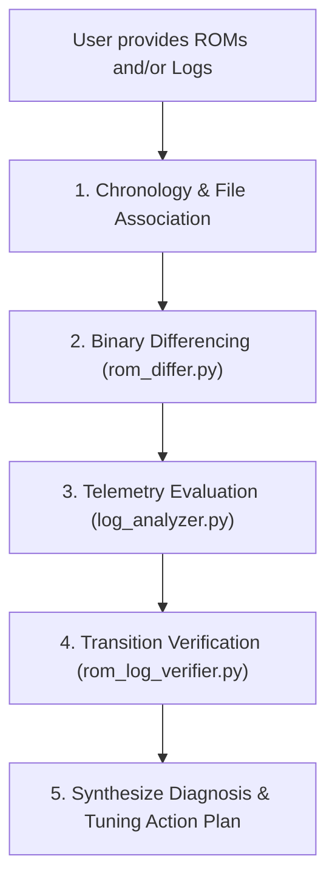

# Mitsubishi Evolution X (4B11T) Tuning & Telemetry Suite

A specialized agentic skill and tool suite for analyzing, diffing, simulating, and validating calibration ROMs and EvoScan datalogs for the Mitsubishi Lancer Evolution X platform.

## Platform Context & Hardware

- **Vehicle**: 2013 Mitsubishi Lancer Evolution X (USDM 5MT)
- **Engine**: 2.0L 4B11T DOHC MIVEC (1,998 cc, 86.0 mm bore x 86.0 mm stroke)
- **ECU**: Renesas M32186F8 (M32R RISC core)
- **Base ROM ID**: `59580004` (USDM 2013 5MT)
- **Patched ROM ID**: `59580304` (TephraMOD v3 + RAX Fast Logging)
- **Induction**: Precision 8474 turbocharger, Full Race 3.5" intake pipe
- **Fuel System**: Injector Dynamics ID1300x, 94 octane pump gas
- **Valvetrain**: GSC S2 camshafts with upgraded valve springs
- **Workspace Root**: `/Users/steven/Library/CloudStorage/GoogleDrive-stevenjohnston.ca@gmail.com/My Drive/Evoman/`
- **Toolkit Root**: `/Users/steven/Library/CloudStorage/GoogleDrive-stevenjohnston.ca@gmail.com/My Drive/Evoman/tuning_tools/`

---

## 1. Quick Reference: Memory Map & Binary Structure

All tools and memory references use standard `.srf` or `.bin` offsets.
> [!IMPORTANT]
> `.srf` (Secure ROM Format) files contain a **328-byte (`0x148`)** metadata header before the raw 1MB/2MB flash image.
> `File Offset = 328 + ROM Memory Address`.

Detailed JSON memory specifications:
[`tuning_tools/references/ecu_memory_map.json`](file:///Users/steven/Library/CloudStorage/GoogleDrive-stevenjohnston.ca@gmail.com/My%20Drive/Evoman/tuning_tools/references/ecu_memory_map.json)

| Calibration Table | ROM Address | File Offset (.srf) | Dimensions | Element Format & Scaling | EcuFlash Units |
| :--- | :---: | :---: | :---: | :---: | :---: |
| **MAF Scaling Horizontal** | `0x5757a` | `0x576c2` | 130 cells | `uint16` (big-endian), `x / 100.0` | g/s |
| **MAF Volts Axis** | `0x61fd0` | `0x62118` | 130 cells | `uint16` (big-endian), `x * 5.0 / 1023.0` | Volts |
| **MAP Load Calc #1 (Hot)** | `0x608ae` | `0x609f6` | 20 MAP x 19 RPM | `uint16` (big-endian), `x * 100 / 1638.4` (`swapxy="true"`) | Load % |
| **MAP Load Calc #2 (Cold)** | `0x605ac` | `0x606f4` | 20 MAP x 19 RPM | `uint16` (big-endian), `x * 100 / 1638.4` (`swapxy="true"`) | Load % |
| **MAP Load Calc #3** | `0x602aa` | `0x603f2` | 20 MAP x 19 RPM | `uint16` (big-endian), `x * 100 / 1638.4` (`swapxy="true"`) | Load % |
| **MAP Table MAP Axis** | `0x6344a` | `0x63592` | 20 cells | `uint16` (big-endian), `((x * 2556 / 3800) + 0.5) / 2` | kPa |
| **High Octane Fuel Map** | `0x55027` | `0x5516f` | 21 Load x 16 RPM | `uint8`, `14.7 * 128 / x` | Target AFR |
| **Calibration Fuel Map** | `0x57713` | `0x5785b` | 41 Load x 19 RPM | `uint8`, `x / 1.28` (Percent128) | Multiplier % |
| **ROM Checksum** | `0xbfff0` | `0xc0138` | 4 bytes | 32-bit CRC (`mitsucan`) | Hex |

---

## 2. CLI Tool Suite Reference

The toolkit in `/Users/steven/Library/CloudStorage/GoogleDrive-stevenjohnston.ca@gmail.com/My Drive/Evoman/tuning_tools/tools/` is written in pure Python 3 using standard libraries (no external dependencies required).

### Tool 1: `rom_differ.py`
Diff two ROM files (`.srf` or `.bin`) and extract exact cell-by-cell deltas and multipliers ($C_{\text{MAF}}$, $C_{\text{MAP}}$).
```bash
python3 "/Users/steven/Library/CloudStorage/GoogleDrive-stevenjohnston.ca@gmail.com/My Drive/Evoman/tuning_tools/tools/rom_differ.py" \
  "rom_A.srf" "rom_B.srf" [--all]
```
- Outputs changed cells, percentage deltas, and average multipliers.
- Identifies if table modifications were localized or global.

### Tool 2: `log_analyzer.py`
Processes EvoScan CSV logs with warm-engine filtering, regime classification, and statistical load/AFR error tracking.
```bash
python3 "/Users/steven/Library/CloudStorage/GoogleDrive-stevenjohnston.ca@gmail.com/My Drive/Evoman/tuning_tools/tools/log_analyzer.py" \
  "EvoScanDataLog.csv" [--ect 70] [--app 5] [--json]
```
- Filters out decel fuel cut (TPS < 13%), cold engine (ECT < 70°C), and transient throttle spikes.
- Breaks down vehicle operation into regimes:
  - **Idle**: RPM < 1100, Speed < 5 km/h
  - **Cruise**: TPS < 22%, Load 40–110%, RPM 1500–3500
  - **Mid-Load**: Load 110–160%
  - **Boost / WOT**: Load > 160% or TPS > 50%
- Computes AFR error bands (p10, p25, median, p75, p90), target ratio deviation, and knock sums.

### Tool 3: `rom_log_verifier.py`
Validates the physical response and empirical gain between sequential ROM flashes and their corresponding logs.
```bash
python3 "/Users/steven/Library/CloudStorage/GoogleDrive-stevenjohnston.ca@gmail.com/My Drive/Evoman/tuning_tools/tools/rom_log_verifier.py" \
  "rom_old.srf" "rom_new.srf" "log_old.csv" "log_new.csv"
```
- Performs matched-cell pairing between old and new logs based on MAF Voltage ($\pm 0.04\text{ V}$) and RPM ($\pm 100\text{ RPM}$).
- Tests the $MAFCalcs$ prediction hypothesis: $MAFCalcs_{\text{predicted}} = MAFCalcs_{\text{old}} \times C_{\text{MAF}}$.
- Measures the empirical fueling gain: $\text{AFR Gain} = \frac{\Delta AFR\%}{\Delta MAF\%}$.

### Tool 4: `rom_extractor.py`
Extracts calibration tables from `.srf`/`.bin` into formatted ASCII tables, CSV, TSV (for direct EcuFlash clipboard paste), or JSON.
```bash
python3 "/Users/steven/Library/CloudStorage/GoogleDrive-stevenjohnston.ca@gmail.com/My Drive/Evoman/tuning_tools/tools/rom_extractor.py" \
  "rom.srf" [--table maf|map|fuel] [--format text|tsv|json]
```

### Tool 5: `balancer_simulator.py`
Simulates LogChopper's MAF & MAP Balancer algorithm on any ROM and log, allowing experimentation with enhancements.
```bash
python3 "/Users/steven/Library/CloudStorage/GoogleDrive-stevenjohnston.ca@gmail.com/My Drive/Evoman/tuning_tools/tools/balancer_simulator.py" \
  "rom.srf" "log.csv" [--feed-forward] [--soft-blend] [--damping 0.33]
```

### Tool 6: `m32r_inspector.py`
CLI inspector and disassembler for the Renesas M32R ECU microcontroller.
```bash
# Dump MCU vector table (Interrupts, ADC, Timers, CAN Bus)
python3 "/Users/steven/Library/CloudStorage/GoogleDrive-stevenjohnston.ca@gmail.com/My Drive/Evoman/tuning_tools/tools/m32r_inspector.py" \
  vectors "path/to/rom.hex.bin"

# Cross-reference all code referencing a calibration table (e.g. MAF Scaling 0x5757A)
python3 "/Users/steven/Library/CloudStorage/GoogleDrive-stevenjohnston.ca@gmail.com/My Drive/Evoman/tuning_tools/tools/m32r_inspector.py" \
  xref 0x5757A "path/to/rom.hex.bin"

# Disassemble a range of instructions in the ROM
python3 "/Users/steven/Library/CloudStorage/GoogleDrive-stevenjohnston.ca@gmail.com/My Drive/Evoman/tuning_tools/tools/m32r_inspector.py" \
  disasm 0x0FB060 "path/to/rom.hex.bin" -n 20
```

### Tool 7: `export_ghidra_symbols.py`
Generates Ghidra scripts (`GhidraImportEvo10Symbols.java`) and CSV symbol maps from EcuFlash XML definitions to auto-label 402+ tables and memory locations.
```bash
python3 "/Users/steven/Library/CloudStorage/GoogleDrive-stevenjohnston.ca@gmail.com/My Drive/Evoman/tuning_tools/tools/export_ghidra_symbols.py"
```

### Tool 8: `scan_rom_tables.py`
Scans the raw ROM binary for all 2D and 3D table metadata descriptors, detects unmapped calibration maps, and exports an EcuFlash XML patch.
```bash
python3 "/Users/steven/Library/CloudStorage/GoogleDrive-stevenjohnston.ca@gmail.com/My Drive/Evoman/tuning_tools/tools/scan_rom_tables.py" \
  "rom.hex.bin"
```

### Tool 9: `decompile_ecu.py`
Batch decompiles ECU firmware into human-readable C source files saved to `decompiled_c/`.
```bash
python3 "/Users/steven/Library/CloudStorage/GoogleDrive-stevenjohnston.ca@gmail.com/My Drive/Evoman/tuning_tools/tools/decompile_ecu.py" \
  "rom.hex.bin" [--func 0x022A80 --name fuel_calc]
```

### Tool 10: `load_envelope_analyzer.py`
Diagnoses ECU engine load clamping and determines whether the engine is running on MAF or Speed Density (MAP envelope).
```bash
python3 "/Users/steven/Library/CloudStorage/GoogleDrive-stevenjohnston.ca@gmail.com/My Drive/Evoman/tuning_tools/tools/load_envelope_analyzer.py" \
  "EvoScanDataLog.csv" [--ect 70]
```
- Quantifies percent of time spent in Pure MAF Control vs Clamped to MAP vs Clamped to IMAP.
- Generates 2D RPM vs MAP (kPa) load truncation heatmaps.
- Warns if MAF Scaling is over-scaled relative to `MAP based Load Calc` tables.

### Tool 11: `match_roms_and_logs.py`
Automatically scans `roms/` and `scans/`, sorting by timestamp and pairing the latest ROMs with their corresponding datalogs according to the chronological association rule.
```bash
python3 "/Users/steven/Library/CloudStorage/GoogleDrive-stevenjohnston.ca@gmail.com/My Drive/Evoman/tuning_tools/tools/match_roms_and_logs.py" [limit]
```

### Tool 12: `rom_memory_differ.py`
Full 1MB byte-by-byte ROM memory differ with automated EcuFlash XML symbol mapping and decompiled M32R firmware routine cross-referencing.
```bash
python3 "/Users/steven/Library/CloudStorage/GoogleDrive-stevenjohnston.ca@gmail.com/My Drive/Evoman/tuning_tools/tools/rom_memory_differ.py" \
  "rom_old.srf" "rom_new.srf" [--all] [--json]
```
- Scans the full 1MB flash image, groups changed address ranges, and maps them to tables and symbols.
- Links modified memory blocks directly to decompiled C routines in `tuning_tools/decompiled_c/`.
- Explains the exact mechanical and ECU control-loop consequences of each parameter change.

### Tool 13: `log_scorer.py`
Automated datalog scoring and calibration health evaluation suite.
```bash
python3 "/Users/steven/Library/CloudStorage/GoogleDrive-stevenjohnston.ca@gmail.com/My Drive/Evoman/tuning_tools/tools/log_scorer.py" \
  "log1.csv" ["log2.csv" ...] [--json]
```
- Evaluates telemetry on an objective 0–100 scale across 4 core pillars:
  1. **Fuel Delivery Accuracy (/40 pts)**: Median AFR error, RMSE, and error band coverage.
  2. **Load Balance & Envelope Coherence (/30 pts)**: Target ratio tracking, vacuum inversion rate, ceiling clamping rate.
  3. **Drivability Smoothness (/20 pts)**: Idle RPM variance, idle AFR variance, cruise AFR scatter.
  4. **Engine Safety (/10 pts)**: Knock count and lean-under-boost detection.
- Provides multi-log comparison tables to determine whether sequential calibration flashes are progressing, deteriorating, or oscillating.

### Tool 14: `fill_log_afrmap.py`
Reconstructs and interpolates missing `AFRMAP` values in EvoScan datalogs directly from the ROM's `High Octane Fuel Map` (`0x55027`, 21 Load rows x 16 RPM columns).
```bash
python3 "/Users/steven/Library/CloudStorage/GoogleDrive-stevenjohnston.ca@gmail.com/My Drive/Evoman/tuning_tools/tools/fill_log_afrmap.py" \
  "log1.csv" ["log2.csv" ...] [--rom "path/to/rom.srf"]
```
- Performs the exact bilinear interpolation of `uint8` raw table values mapped against `Load` and `RPM` matching ECU firmware routine `0x022A48`.
- Converts raw byte interpolation to AFR via $14.7 \times 128 / \text{round}(val)$, matching RAX fast logging output to within $0.0002\text{ AFR}$ accuracy.
- Automatically creates `.csv.bak` backups before modifying the log in place.

### Tool 15: `mat_thermal_analyzer.py`
Decoupled thermal compensation analyzer that isolates pure manifold air temperature drift relative to Cold-Witnessed baseline AFR.
```bash
python3 "/Users/steven/Library/CloudStorage/GoogleDrive-stevenjohnston.ca@gmail.com/My Drive/Evoman/tuning_tools/tools/mat_thermal_analyzer.py" \
  --cold-log "scans/morning_baseline.csv" \
  --hot-log "scans/noon_heatsoaked.csv" \
  --rom "roms/latest_rom.srf"
```
- Targets **Cold-Witnessed Baseline AFR**, enforcing thermal decoupling rather than cross-coupling temperature multipliers to base model errors.
- Automatically computes thermal drift: $\Delta_{\text{thermal}} = \frac{\text{AFR}_{\text{hot}}}{\text{AFR}_{\text{cold\_witnessed}}}$.
- Enforces strict EcuFlash Cold-to-Hot orientation (Row 0 = $-10^\circ\text{C}$ / $14^\circ\text{F}$, Row 6 = $100^\circ\text{C}$ / $212^\circ\text{F}$), preventing dangerous table inversions.
- Outputs tab-delimited paste buffers ready for immediate insertion into EcuFlash.

---

## 2.1 Ghidra Decompiler & Firmware Analysis Environment

- **Decompiler**: Ghidra 12 (`/opt/homebrew/bin/ghidraRun`)
- **Runtime**: OpenJDK 21 (`/opt/homebrew/opt/openjdk@21`)
- **Processor Architecture**: Renesas M32R (`m32r:2:default`) with full memory map, peripheral SFRs, and interrupt tables.
- **Auto-Symbol Importer**: Run `GhidraImportEvo10Symbols.java` from Ghidra's Script Manager on imported ROMs to automatically label all calibration maps, lookup tables, and RAM registers in C pseudocode.

---

## 3. Mathematical Fundamentals & Calibrator Principles

### 1. The MAF Load Equation
Engine Load in the 4B11T ECU is calculated as:
$$MAFCalcs = \frac{K \times T_{\text{MAF}}(V)}{RPM}$$
Where theoretical STP cylinder displacement physics yields $K = 4988.4$.
- **Empirical Constant**: Logs confirm $K = 4,964 \pm 20$ (within $0.5\%$).
- **Linearity Rule**: At constant RPM and MAF Volts, $MAFCalcs$ scales **1:1** with changes in the `MAF Scaling Horizontal` table multiplier $C_{\text{MAF}}$:
  $$MAFCalcs_{\text{predicted}} = MAFCalcs_{\text{log}} \times C_{\text{MAF}}$$

### 2. Empirical Fueling Response Gain
- On large aftermarket injectors (ID1300) and 3.5" intake piping, steady cruise exhibits an empirical fueling gain of:
  $$\text{Gain} = \frac{\Delta AFR\%}{\Delta MAF\%} \approx 2.0\times$$
  (A $+1.0\%$ increase in MAF Scaling produces a $\approx -2.0\%$ drop in AFR / richening).
- **Stability Requirement**: LogChopper's $1/3$ ($0.33$) damping factor is mandatory to maintain closed-loop stability:
  $$\text{Net Loop Gain} \approx 2.0 \times 0.333 \approx 0.67 < 1.0 \quad (\text{stable monotonic convergence})$$

### 3. Closed-Loop Fuel Trim Compensation
Standard LogChopper assumes Open-Loop (`AFR_ERR = AFR / AFRMAP`). In closed loop, the ECU trims fuel back to stoichiometric (14.7), masking the true error. When closed loop is active:
$$AFR_{\text{error}} = \left(1.0 - \frac{STFT + LTFT}{100.0}\right) \times \frac{AFR}{AFRMAP}$$

### 4. Feed-Forward MAP Coupling
When MAF scaling is updated by $C_{\text{MAF}}$, MAP Load Calc should target the projected new MAF load rather than the stale logged MAF load:
$$Target\_MAPCalcs = TARGET\_RATIO \times (MAFCalcs \times C_{\text{MAF}})$$
$$MAP\_CORR_{\text{projected}} = MAP\_CORR \times C_{\text{MAF}}$$

### 5. Master Load Clamping & Speed Density Envelope Equation
As proven by decompiled routines `0x04DC64` (`load_clamp_or_blend`) and `0x02FDC4` (`map_load_calc_and_blend_engine`):
$$\text{Lower} = \min(MAPCalcs, IMAPCalcs)$$
$$\text{Upper} = \max(MAPCalcs, IMAPCalcs)$$
$$\text{ChosenCalc} = \text{clamp}(MAFCalcs_{\text{filtered}}, \text{Lower}, \text{Upper})$$
- **Steady-State Ceiling Rule**: During steady cruise and idle ($\Delta TPS \le 1.0\%$), `IMAPCalcs = 0.0` (baseline register `0x00808810` loaded from ROM `0x053CAE = 0x0000`).
  $$\text{Lower} = 0.0, \quad \text{Upper} = MAPCalcs \implies \mathbf{ChosenCalc = \min(MAFCalcs_{\text{filtered}}, MAPCalcs)}$$
  **`MAPCalcs` is an UPPER CEILING, not a bilateral lock.** When $MAFCalcs \le MAPCalcs$, the car runs on pure filtered MAF. When $MAFCalcs > MAPCalcs$, the ECU clips load down to `MAPCalcs`.
- **Identical MAP Tables**: Even when `MAP based Load Calc #1 (Hot)`, `#2 (Cold)`, and `#3` are calibrated identically in the ROM, the clamping window does **not** collapse to zero width because the lower bound is governed by `IMAPCalcs` ($0.0$), not another table. Setting all 3 tables equal simply eliminates Coolant Temp (ECT) and cam overlap blending variations.
- **Dynamic Transient Envelope**: On rapid throttle tip-in ($\Delta TPS > 1.0\%$), the transient state machine (`0x01A7D8`) ramps blend weight `0x0080A8F6` from $0 \to 256$, driving `IMAPCalcs` **above `MAPCalcs`**. This temporarily raises the ceiling to allow the turbocharger spool airflow spike to pass without truncation.
- **The 5% MAP Adder ($269/256 = 1.05078$)**: Routine `0x02FDC4` multiplies the 3D table lookup by $(256 + 0x05494C)/256 = 269/256 = 1.05078$ ($+5.08\%$). This firmware adder is the exact physical origin of LogChopper's $1.05$ target ratio at vacuum.
- **Transient Smoothing**: Raw MAF load is passed through a 1st-order discrete low-pass lag filter (`0x04E050`):
  $$y[n] = \frac{\alpha \cdot y[n-1] + (256 - \alpha) \cdot x[n]}{256}$$
  where $\alpha$ is dynamically retrieved from `Load Ramp Rate #1 (Load>70)` (`0x54AD0`, raw `0x00E6` = 89.8% lag) or boost error tables `0x5D68C`/`0x5D6EC`.
- **Tuning Rule**: If `MAF Scaling` is increased without raising `MAP based Load Calc #1 (Hot)` (`0x608AE`), the ECU will **clamp engine load down to MAPCalcs**, causing fuel and ignition timing to hit an artificial ceiling.

### 6. The "Dual Pull-Down" Flaw & Ground Truth Airflow Balancing
Analysis of LogChopper's classic balancer reveals destructive instability under inverted vacuum conditions ($MAFCalcs > MAPCalcs$):
- **The Classic Error**: When $MAFCalcs > MAPCalcs$, classic LogChopper applies $C_{\text{MAF}} = \frac{MAPCalcs \times AFR\_ERR}{TARGET\_RATIO \times MAFCalcs}$.
  Since $\frac{MAPCalcs}{TARGET\_RATIO \times MAFCalcs} \le \frac{1.0}{1.05} \approx 0.952$, this artificially **reduces MAF Scaling even when the engine is running lean**! Lowering MAF reduces base injector pulse width ($IPW$), starving the engine and causing subsequent flashes to drift even leaner.
- **The Ground Truth Airflow Principle**:
  Because the ECU calculates fuel from the lower of the two sensors ($\min(MAFCalcs, MAPCalcs)$):
  1. **Ground Truth Airflow ($\text{Load}_{\text{true}}$)**:
     The wideband O2 sensor directly measures the fueling error of whichever sensor was active:
     $$\mathbf{\text{Load}_{\text{true}} = \min(MAFCalcs, MAPCalcs) \times AFR\_ERR}$$
     where $AFR\_ERR = \left(1.0 - \frac{STFT + CurrentLTFT}{100.0}\right) \times \frac{AFR}{AFRMAP}$.
  2. **Regime-Targeted Assignment**:
     - **In Vacuum ($\text{MAP} \le 80\text{ kPa}$)**: MAF is the fuel master, MAP is the $1.05\times$ ceiling:
       $$Target\_MAF = \text{Load}_{\text{true}}, \quad Target\_MAP = 1.05 \times \text{Load}_{\text{true}}$$
       $$C_{\text{MAF}} = \frac{\text{Load}_{\text{true}}}{MAFCalcs}, \quad C_{\text{MAP}} = \frac{1.05 \times \text{Load}_{\text{true}}}{MAPCalcs}$$
     - **In Boost ($\text{MAP} \ge 120\text{ kPa}$)**: MAP is the fuel master, MAF is the $1.053\times$ ($1/0.95$) headroom:
       $$Target\_MAP = \text{Load}_{\text{true}}, \quad Target\_MAF = \frac{\text{Load}_{\text{true}}}{0.95}$$
       $$C_{\text{MAP}} = \frac{\text{Load}_{\text{true}}}{MAPCalcs}, \quad C_{\text{MAF}} = \frac{\text{Load}_{\text{true}}}{0.95 \times MAFCalcs}$$
  3. **Continuous Regime Blending**:
     Using continuous weighting $W = \text{clamp}\left(\frac{120.0 - \text{MAP}}{40.0}, 0.0, 1.0\right)$:
     $$C_{\text{MAF}} = \frac{\text{Load}_{\text{true}} \times \left(W + \frac{1.0 - W}{TARGET\_RATIO}\right)}{MAFCalcs}$$
     $$C_{\text{MAP}} = \frac{\text{Load}_{\text{true}} \times \left(W \times TARGET\_RATIO + (1.0 - W)\right)}{MAPCalcs}$$
  This completely eliminates circular dependencies, stops the clamp starvation trap, and sets the exact 5% buffer in a single flash without overshoot.

### 7. Thermal Decoupling & Cold-Witnessed Invariance Principle
- **Decoupled Architecture**: The `Fuel Compensation MAT vs MAP` table (`0x60FCD`) has only one physical responsibility: **Thermal Invariance** ($\frac{\partial \text{AFR}}{\partial \text{MAT}} = 0$). It ensures that high manifold temperatures ($40^\circ\text{C}\text{--}60^\circ\text{C}+$) do not cause AFR to drift from the cold/reference baseline ($20^\circ\text{C}$).
- **The Direct Targeting Anti-Pattern**: Never calibrate MAT cells to directly target `AFRMAP` (e.g. 14.70). If the base engine model has a baseline error at $20^\circ\text{C}$ (e.g., running 14.51 AFR), pulling extra fuel in the MAT table creates cross-coupling. When the base MAF table is later retuned, the MAT table will carry a permanent "ghost bias" and over-correct in varying climates.
- **2-Step Calibration Protocol**:
  1. **Isolate Thermal Drift**: $\Delta_{\text{thermal}} = \frac{\text{AFR}_{\text{hot}}}{\text{AFR}_{\text{cold\_witnessed}}}$.
  2. **Achieve Thermal Invariance**: Multiply hot MAT cells by $\Delta_{\text{thermal}}$ so that hot AFR perfectly tracks cold witnessed AFR.
  3. **Base Model Convergence**: Fix the remaining global error from `AFRMAP` (14.70) strictly at the root via **MAF Scaling** and **MAP based Load Calc** (LogChopper).

### 8. EcuFlash Table Architecture & swapxy Column-Major Reality
- **swapxy Column-Major Layout**: In EcuFlash XML, `Fuel Compensation MAT vs MAP` uses `swapxy="true"`. This transposes the memory buffer so that raw binary memory is stored column-major: `offset = map_col * 7 + mat_row`.
- **True EcuFlash GUI Grid (Cold-to-Hot from top to bottom)**:
  - Row 0: $-10^\circ\text{C}$ ($14^\circ\text{F}$) -> Factory is **100.0% across all MAP readings**.
  - Row 1: $5^\circ\text{C}$ ($41^\circ\text{F}$) -> Factory is **100.0% across all MAP readings**.
  - Row 2: $20^\circ\text{C}$ ($68^\circ\text{F}$) -> Factory ranges 106.1% (vacuum) down to 100.0% (boost).
  - Row 3: $40^\circ\text{C}$ ($104^\circ\text{F}$) -> Factory ranges 109.0% down to 100.0%.
  - Row 4: $60^\circ\text{C}$ ($140^\circ\text{F}$) -> Factory ranges 113.1% down to 100.0%.
  - Row 5: $80^\circ\text{C}$ ($176^\circ\text{F}$) -> Factory ranges 115.0% down to 100.0%.
  - Row 6: $100^\circ\text{C}$ ($212^\circ\text{F}$) -> Factory ranges 117.0% down to 100.0%.
- **Why Compensation Rises With MAT**: Mitsubishi factory calibration adds fuel as intake manifold temperature rises (from 100% at $14^\circ\text{F}$ up to 117% at $212^\circ\text{F}$ in vacuum) to counteract charge heating, reduced volumetric efficiency, fuel puddle evaporation, and detonation sensitivity under heat soak.
- **ROM 11 Over-Inflation**: ROM 11 pushed rows 3–6 up to 124%, directly causing the noon 5% rich drift. Trimming rows 3–6 back toward the factory curve eliminates the heat-soak rich drift.

### 9. EcuFlash 3D Table GUI Grid Orientation Standards (RPM Rows vs MAP/Load Columns)
- **Universal EcuFlash Convention**: In EcuFlash, all 3D engine tables (`MAP based Load Calc #1 & #2`, `High Octane Fuel Map`, `High Octane Timing Map`, `MIVEC Intake/Exhaust`, etc.) display:
  - **Vertical Rows = Engine RPM**
  - **Horizontal Columns = MAP / Load (or TPS / Airflow)**
- **MAP based Load Calc Architecture (`0x608AE` / `0x605AC`)**:
  - **Rows**: **19 RPM Rows** (`500, 750, 1000, 1250, 1500, 1750, 2000, 2500, 3000, 3500, 4000, 4500, 5000, 5500, 6000, 6500, 7000, 7500, 8000 RPM`).
  - **Columns**: **20 MAP Columns** (`13.7, 22.1, 35.6, 49.0, 62.5, 75.9, 89.4, 102.8, 116.3, 129.7, 143.2, 156.6, 170.1, 183.5, 197.0, 210.4, 223.9, 237.4, 250.8, 304.6 kPa`).
  - **Grid Size**: Exactly **19 Rows × 20 Columns = 380 Cells**.
- **Memory Layout vs GUI Rendering (`swapxy="true"`)**:
  - In raw M32R firmware, the 380 words are stored **column-major**: `offset = map_col * 19 + rpm_row`.
  - **The Transposition Anti-Pattern**: Slicing the binary memory by contiguous chunks (`scaled[m * 19 : (m + 1) * 19]`) yields 20 slices of 19 values. Emitting these directly as table rows creates a transposed **20 Rows × 19 Columns** matrix. When pasting into EcuFlash, the software immediately fails with a clipboard dimension mismatch.
  - **Mandatory Clipboard Format**: All paste blocks generated for `MAP based Load Calc` MUST be formatted as **19 lines (one line per RPM row) with 20 tab-separated values per line**:
    ```python
    for r in range(19):  # RPM rows
        row = [scaled_load[m * 19 + r] for m in range(20)]  # MAP columns
        print("\t".join(f"{x:.1f}" for x in row))
    ```

---

## 4. Standard Agentic Investigation Workflow

When the user asks to analyze recent ROMs, datalogs, or balancer iterations:



1. **Step 1: Chronology & Association Rule (MANDATORY)**:
   - **Always select the LATEST files**: Sort `roms/` and `scans/` by timestamp (`ls -lt`). Never pick older historical logs or ROMs unless explicitly asked.
   - **The Chronological Rule**: Any log file whose creation timestamp falls between $ROM_N$ and $ROM_{N+1}$ **belongs to the older ROM ($ROM_N$)**. It records vehicle operation on $ROM_N$ prior to flashing $ROM_{N+1}$.
   - Once $ROM_{N+1}$ is created/flashed, subsequent logs belong to $ROM_{N+1}$ until a newer ROM appears.
2. **Step 2: Binary Differencing**:
   - Run `rom_differ.py` to identify changed addresses and compute $C_{\text{MAF}}$.
   - Verify that non-target tables (ignition, fuel, boost) were not unintentionally modified.
3. **Step 3: Telemetry Evaluation**:
   - Run `log_analyzer.py` on each session log.
   - Record:
     - Median AFR error (convergence towards 1.0000)
     - Idle AFR (14.7 target) and Cruise AFR (14.7 target)
     - Mean Load Ratio vs target curve (target: 1.05 at vacuum, 0.95 at boost)
     - Knock events (ensure 0 knock counts across steady state)
4. **Step 4: Transition Verification**:
   - Run `rom_log_verifier.py` across the flash transition.
   - Confirm $MAFCalcs$ moved in the direction and magnitude predicted by $C_{\text{MAF}}$.
5. **Step 5: Diagnosis & Action Plan**:
   - Classify overall trend: **Better** (converging on target), **Worse** (diverging/oscillating), or **Indecisive** (insufficient warm steady-state data).
   - Flag any algorithm flaws (boundary chatter, moving-target lag, closed-loop trim masking).
