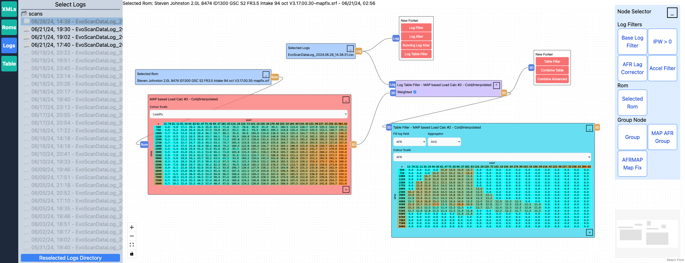

# EVO X Web-based Tuning

## About the Project

This car tuning software leverages a variety of web technologies to provide in-depth analysis of vehicle data. Key features include:

- ROM file (.bin, .srf) table extraction and visualization ([ECUFlash](https://www.tactrix.com/index.php?option=com_content&view=category&layout=blog&id=36) compatible)
- Sensor data (.csv) overlay, filtering, and custom logic application
- Efficient handling of large log files (10k+ entries)
- Multiple log file selection (.csv)
- Combine ROM table and sensor data
- Combine and aggregate tables
- Savable logic groupings
- Downloadable Progressive Web APP (PWA) available for offline use

Although developed for my personal use, the project may be of interest to car enthusiasts or developers working with similar data formats. Please note while it should work with other ECUFlash compatible vehicles, I have only tested on an 2015 EVO X.

## Technologies

This project is pretty much just a DAG in the browser.

- [Next.js](https://nextjs.org/) - app router - All `use client` so it can be hosted on github pages
- [React Flow](https://reactflow.dev/) - Handles visual representations of data and relationships
- [expr-eval](https://www.npmjs.com/package/expr-eval) - "A safer and more math-oriented alternative to using JavaScript’s eval"
- [Apache ECharts](https://echarts.apache.org/en/index.html) - 3D Surface charts for table visualization.
- [Zustand](https://zustand-demo.pmnd.rs/) - State management
- [Tailwind CSS](https://tailwindcss.com/) - Simply Pretty
- [GitHub Actions](https://github.com/features/actions) CI/CD
- [GitHub Pages](https://pages.github.com/) Host this WebApp
- [Web Workers](https://developer.mozilla.org/en-US/docs/Web/API/Web_Workers_API/Using_web_workers) - Offload heavy processes to Web Workers.
- [Progressive web app](https://developer.mozilla.org/en-US/docs/Web/Progressive_web_apps) - Downloadable offline site

## Getting Started

This software does not ship with any files. Please source definition files (.xml) Roms (.bin, .srf) and log files (.csv) elsewhere. If you are unfamiliar with ECU Flash, and EvoScan I suggest you look into those first.

### File selection

This app requires access to 3 different file directories. Which can be set by selecting the buttons on the left tool bar.  
\*Due to security risk the web browser limits file access and these step will be required upon each visit. However, on additional visits the app will remember the selected directory paths and should open directly to them.

|      | Directory Selection                                                                                                                                                                                       | Sidebar                                                                                                                                                      |
| ---- | --------------------------------------------------------------------------------------------------------------------------------------------------------------------------------------------------------- | ------------------------------------------------------------------------------------------------------------------------------------------------------------ |
| XMLs | This directory must include all of your .xml files as many XMLs inherit from other parent XMLs. eg. If you have ECUFlash installed you can find and select the directory that holds all its XML files. | Select your ROM's XML definition \*This file will be remember and auto selected after directory selection on future page visits.                             |
| Roms | Select the directory with your ROM (.bin, .srf) in it.                                                                                                                                                    | Select the ROM you wish view. This will spawn a "Selected ROM" Node on the canvas. Selecting another ROM will automatically reprocess all down stream Nodes. |
| Logs | Select the directory with your log (.csv) in it.                                                                                                                                                          | Select the Log(s) you wish view. Logs created before the selected ROM will appear as greyed out, but can still be selected                                   |

### Usage

Similar to a flow chart this app allows you to spawn `Nodes` with differing functionality. These `Nodes` can be be chained together to accomplish many tasks.

### Node

Here explains how each of the Nodes can be used

| Type                      | How to spawn                                | Usage                                                                                                                                                                                                                                                                                                                                                                                        |
| ------------------------- | ------------------------------------------- | -------------------------------------------------------------------------------------------------------------------------------------------------------------------------------------------------------------------------------------------------------------------------------------------------------------------------------------------------------------------------------------------- |
| Base Rom                  | Select .bin, .srf in ROM Sidebar            | Contains ROM file and can be connected to `Base Table` Nodes                                                                                                                                                                                                                                                                                                                                 |
| Base Log                  | Select .csv in Logs Sidebar                 | Contains LogRecords for each of the select log files                                                                                                                                                                                                                                                                                                                                         |
| Base Table                | Select a table from the Table Sidebar       | Once connected to a `Selected ROM` node, will be populated with the data from the the .bin, .srf file                                                                                                                                                                                                                                                                                        |
| Fork Node                 | Drag from Log or Table Node Handle          | Allows other Nodes to be spawned                                                                                                                                                                                                                                                                                                                                                             |
| --- Log Related ---       | ---                                         | ---                                                                                                                                                                                                                                                                                                                                                                                          |
| Log Filter                | Select in `Fork Node` from Log              | Filters out LogRecords.  \*Acts like Array.map (Why not Array.filter? The LogRecords is only flagged for deletion, so that additional LogNodes have the full set of LogRecords)                                                                                                                                                                                                           |
| Log Alter                 | Select in `Fork Node` from Log              | Adds a new field to each LogRecord.  \*Acts like Array.map                                                                                                                                                                                                                                                                                                                                |
| Running Log Alter         | Select in `Fork Node` from Log              | Adds a new field to each LogRecord using future LogRecords.  \*Acts like Array.reduce, but for each LogRecord. Useful when future log data is required                                                                                                                                                                                                                                    |
| Moving Average Log Filter | Select in `Fork Node` from Log              | Filter out LogRecords using a Moving Average. Useful when future and/or past LogRecord data is required                                                                                                                                                                                                                                                                                      |
| --- Table Related ---     | ---                                         | ---                                                                                                                                                                                                                                                                                                                                                                                          |
| Combine Table             | Select in `Fork Node` from table            | Combines tables with the same dimensions together via a custom function. `sourceTable` and `joinTable` can be used with the function.  eg. `sourceTable[y][x] + joinTable[y][x]` would add the values in both tables together                                                                                                                                                             |
| Combine Advanced Table    | Select in `Fork Node` from table            | Combines tables together using custom axis.  eg.  The `Fuel Map` has Axis y: `RPM` and x: `LOAD` with a table value of v: `AFR`.  The `MAP Load Calc` has Axis y:`RPM` and x:`MAP` with a table value of v:`LOAD`.  With this Node we can overlay `AFR` from `Fuel Map` on to `MAP Load Calc` using the common `RPM` axis as well as the `LOAD` axis's of the 2 differing tables |
| --- Log + Table ---       | ---                                         | ---                                                                                                                                                                                                                                                                                                                                                                                          |
| Fill Log Table            | Select in `Fork Node`                       | Adds all LogRecords not marked for deletion to a `Base Table`. See `Fill Table` for further usage                                                                                                                                                                                                                                                                                            |
| Fill Table                | Select in `Fork Node` from `Fill Log Table` | Aggregates (avg, min, max, sum, count) LogRecord from `Fill Log Table`.                                                                                                                                                                                                                                                                                                                      |
| --- Other ---             | ---                                         | ---                                                                                                                                                                                                                                                                                                                                                                                          |
| Group Node                | In `Node Selector` at top-right of app      | Allows you to group Nodes together and save them. Saved group nodes will appear in the `Node Selector`                                                                                                                                                                                                                                                                                       |
| AFRMAP MAP Fix            | In `Node Selector` at top-right of app      | Adjust MAP load calcs table to target AFRMAP in logs. Some call this the volumetric efficiency                                                                                                                                                                                                                                                                                               |
| MAP AFR Group             | In `Node Selector` at top-right of app      | Adjust MAP load calcs table to target the Fuel MAP in logs. Some call this the volumetric efficiency. This one is deprecated if you are logging AFRMAP                                                                                                                                                                                                                                       |

## Disclaimers

- Use at own risk. I take no responsibility for any damages to your vehicle
- I am not a disassembled engineer. My underlying understanding of the ECU is very rudimentary.
- I have not tested little endian
- Currently only 3D tables work
- .srf files assume a header of 328 bytes

## Development

### Node Boiler

When creating a new Node these files will likely require reference

React flow  
`app/store/useFlow.ts`  
`app/_components/Flow.tsx`

Loadable node  
`app/_components/FlowNodes/FlowNodesConsts.tsx`

Fork  
`app/_components/FlowNodes/FlowNodesConsts.tsx`

### Roadmap

#### General

- Better Table<LogRecord[]> vs Table<string|number> typeguard's - isTableLogRecord, isTableBasic
- ~~Webworkers~~ - ArrayBuffers
- Improve eval variable naming
- Node naming - Allow nodes to have custom names
- Node tooltips/tutorials
- Table select Node
- Custom LogRecord field names

#### LOG

- Auto select logs based on ROM

#### TABLE

- Cell smoothing - Allow table cells to be smoothed based on surrounding cells
- Custom table values
