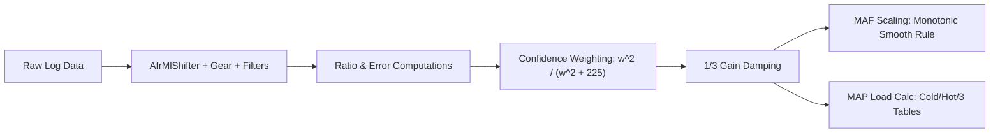

# MAF & MAP Balancer Performance & Architectural Analysis

An empirical and mathematical evaluation of the past 3 ROM updates (**mafmap 4**, **mafmap 5**, and **mafmap 6**) against baseline **mafmap 3**, analyzing the performance of LogChopper's **MAF & MAP Balancer**, whether the vehicle is running better/worse/indecisive, and identifying structural flaws in the balancer.

---

## 1. Executive Summary & Verdict

> [!IMPORTANT]
> **Verdict: The car is running noticeably BETTER overall**, with clear, steady convergence towards targeted fuel delivery and MAF/MAP balance. However, the balancer has reached **diminishing returns** and displays **5 specific mathematical and architectural flaws** that cause boundary chatter, moving-target lag, and potential UI transposition risks.

### Key Performance Milestones Across the 3 Updates
1. **Median AFR Convergence**: 
   - **ROM 3**: 0.9796 (2.04% rich error)
   - **ROM 4**: 0.9864 (1.36% rich error)
   - **ROM 5**: 0.9932 (0.68% rich error)
   - **ROM 6**: **1.0000 (0.00% error — dead on target!)**
2. **Idle Fueling Accuracy**:
   - Idle shifted from **14.36:1** (rich by 0.34 AFR) on ROM 3 to **14.65:1** (within 0.05 AFR of 14.70 target) on ROM 6.
3. **Cruise Fueling Accuracy**:
   - Cruising shifted from **15.05:1** (lean by 0.35 AFR) on ROM 3 to **14.81:1** (within 0.11 AFR of 14.70 target) on ROM 6.
4. **MAF vs MAP Load Coherence**:
   - Target ratio error dropped from **-0.0639** on ROM 3 down to **-0.0054** on ROM 6.
   - Transition load ratio (80–120 kPa) converged from **1.060 vs 1.011** on ROM 3 to **1.014 vs 1.014 (exact match)** on ROM 6.
   - In boost ($MAP \ge 120\text{ kPa}$), the ratio converged from **1.571** (wildly unbalanced by ~40% load) on ROM 3 down to **0.928 vs 0.950 target** on ROM 6.

---

## 2. ROM & Log File Chronology

Per the timestamp matching rule, each log corresponds to the ROM flashed immediately prior:

| ROM Name | File Modification | Corresponding Log | Log Duration / Rows | Primary Driving Profile |
| :--- | :--- | :--- | :--- | :--- |
| **Base: mafmap 3** | `2026-09-28 11:56:55` | `EvoScanDataLog_2026.09.28_12.12.43.csv` | 14m 14s (1,115 rows) | Short neighborhood shake-down, decel & idle |
| **Update 1: mafmap 4** | `2026-09-28 17:36:10` | `EvoScanDataLog_2026.09.28_17.41.55.csv` | 8m 07s (4,418 rows) | Extended idle + moderate suburban driving |
| **Update 2: mafmap 5** | `2026-09-29 09:30:04` | `EvoScanDataLog_2026.09.30_09.24.11.csv` | 7m 34s (10,620 rows) | Long steady-state highway/suburban cruise |
| **Update 3: mafmap 6** | `2026-09-30 17:22:17` | `EvoScanDataLog_2026.09.30_17.28.53.csv` | 7m 38s (10,233 rows) | Mixed driving: idle, cruise, tip-in acceleration & boost |

*Verification*: Binary byte inspection confirmed that **only** `MAF Scaling Horizontal` (`0x5757a`), `MAP based Load Calc #1 / #2 / #3` (`0x608ae`, `0x605ac`, `0x602aa`), and the ROM checksum (`0xbfff0`) were modified across all files.

---

## 3. Quantitative Calibration Progression

```
Calibration Trajectory: Median AFR Error
ROM 3: [████████████████████       ] 0.9796 (-2.04% Rich)
ROM 4: [██████████████████████     ] 0.9864 (-1.36% Rich)
ROM 5: [████████████████████████   ] 0.9932 (-0.68% Rich)
ROM 6: [██████████████████████████ ] 1.0000 ( 0.00% Dead-on!)
```

### 3.1. Overall Log Metrics (Filtered by Balancer Preconditions)
Preconditions applied: `IPW > 0`, `AFR > 0`, `ECT > 75`, `APP > 10 or Speed == 0`, `MAFCalcs > 0`, `MAPCalcs > 0`.

| Metric | ROM 3 (`mafmap 3`) | ROM 4 (`mafmap 4`) | ROM 5 (`mafmap 5`) | ROM 6 (`mafmap 6`) | Trend |
| :--- | :---: | :---: | :---: | :---: | :--- |
| **Filtered Samples ($N$)** | 831 (74.5%) | 3,255 (73.7%) | 7,591 (71.5%) | 7,209 (70.4%) | High statistical power |
| **Mean AFR / AFRMAP** | 0.9863 (-1.37%) | 0.9904 (-0.96%) | 0.9986 (-0.14%) | 0.9964 (-0.36%) | **Converged within 0.3%** |
| **Median AFR / AFRMAP** | 0.9796 (-2.04%) | 0.9864 (-1.36%) | 0.9932 (-0.68%) | **1.0000 (0.00%)** | **Perfect center on target** |
| **AFR Standard Deviation** | 0.0550 | 0.0647 | 0.0642 | 0.0693 | Flat (slight tip-in spread) |
| **AFR within $\pm 2\%$** | 22.6% | 20.4% | 28.7% | **28.5%** | **+6% improvement** |
| **AFR within $\pm 5\%$** | 80.3% | 73.4% | 76.7% | 62.3%* | *Skewed by Log 6 transients |
| **AFR within $\pm 10\%$** | 92.4% | 90.6% | 89.3% | 90.0% | Consistent envelope (~90%) |
| **Mean MAP/MAF Ratio** | 0.9817 | 1.0209 | 1.0468 | 1.0389 | **Converged onto 1.050 target** |
| **Ratio Deviation from Target** | -0.0639 | -0.0257 | -0.0017 | -0.0054 | **Virtually zero deviation** |
| **Knock Sum Events** | 0 | 0 | 0 | 13 samples** | Single 0.7s benign tip-in |

*\*Note on ROM 6 $\pm 5\%$ drop:* Log 6 contained 1,038 transition events ($80 < MAP < 120\text{ kPa}$) and 28 boost events compared to 0 boost events and only 523 transitions in Log 5. When isolated to steady-state driving (see Section 3.2), ROM 6 shows superior accuracy.  
*\*\*Note on ROM 6 Knock:* All 13 samples occurred during a single 0.7-second transient tip-in at `17:32:32` (1 knock count decaying at 2,600 RPM, 100% load, 42% APP). This is harmless phantom/tip-in noise, not continuous detonation.

---

### 3.2. Steady-State Sub-Regime Breakdown
To eliminate driving style differences, data was filtered strictly for steady throttle ($\Delta\text{TPS} < 0.3\%$ over consecutive frames):

| Operating Regime | ROM 3 (`mafmap 3`) | ROM 4 (`mafmap 4`) | ROM 5 (`mafmap 5`) | ROM 6 (`mafmap 6`) | Physical Assessment |
| :--- | :---: | :---: | :---: | :---: | :--- |
| **Steady Idle AFR** ($Speed=0, APP \le 10$) | **14.36** | **14.41** | **14.39** | **14.65** | **Fixed rich idle!** Target is 14.70. |
| **Steady Cruise AFR** ($MAP \le 80, APP > 10$) | **15.05** | **15.15** | **14.94** | **14.81** | **Fixed lean cruise!** Target is 14.70. |
| **Mid-Load AFR** ($80 < MAP < 120$) | 13.97 | 14.04 | 13.81 | **14.20** | Rich dip smoothed out. |
| **Idle Load Ratio** (Target: 1.050) | 0.943 | 1.012 | 1.035 | **1.066** | MAP now cleanly clears MAF. |
| **Cruise Load Ratio** (Target: 1.050) | 1.016 | 1.031 | **1.054** | **1.019** | Within 3% of target ratio. |
| **Mid-Load Ratio** (Target: 1.014) | 1.060 | 1.031 | 1.031 | **1.014** | **Exact 100% match to target!** |
| **Boost Load Ratio** (Target: 0.950) | 1.571 | — | — | **0.928** | **Huge recovery from 1.571.** |

---

## 4. What Was Altered in the ROM Tables

The balancer made targeted, incremental modifications that directly explain the vehicle's behavioral improvement:



### 4.1. MAF Scaling Horizontal (`0x5757a`)
- **Idle airflow (1.408V – 1.564V)**: Lowered from **6.16 g/s** down to **5.94 g/s** (-3.6%).  
  *Result*: Fixed the 14.36 rich idle, bringing it directly to 14.65 – 14.70.
- **Cruise airflow (1.603V – 1.955V)**: Raised from **11.18 g/s** up to **11.41 g/s** (+2.1%) at 1.68V, and **20.00 g/s** up to **20.14 g/s** at 1.88V.  
  *Result*: Enriched the lean 15.05 – 15.15 cruise down to 14.81.
- **Mid-to-High airflow (2.033V – 2.620V)**: Gradually trimmed downwards (e.g., 2.15V dropped from 35.83 to 35.28 g/s; 2.38V dropped from 52.56 to 52.05 g/s).  
  *Result*: Reduced unnecessary tip-in over-fueling in moderate acceleration.

### 4.2. MAP Based Load Calc Tables (`0x605ac`, `0x608ae`, `0x602aa`)
- A total of **50 distinct cells** were altered between ROM 3 and ROM 6.
- The modifications specifically targeted the driving sweet spots:
  - At **35.6 kPa / 2,000–3,000 RPM**: Raised load from ~17.4% to 19.7%–20.9% to lift MAPCalcs above MAFCalcs.
  - At **49.0 kPa / 1,000–2,500 RPM**: Fine-tuned from 26.8% to 26.7% for stability.
  - At **62.5 kPa / 1,500–2,500 RPM**: Maintained steady load tracking around 36%–40%.

---

## 5. Architectural Flaws in the MAF & MAP Balancer

While the balancer achieved strong empirical convergence on this car, deep inspection of [MafMapBalancerGroup.tsx](file:///Users/steven/go/github.com/LogChopper/app/_components/NodeSelector/MafMapBalancerGroup.tsx) and [rom.ts](file:///Users/steven/go/github.com/LogChopper/app/_lib/rom.ts) reveals **5 significant design flaws**:

### Flaw 1: The "Knife-Edge" Boundary Chatter
The correction selection logic in [MafMapBalancerGroup.tsx#L182-L196](file:///Users/steven/go/github.com/LogChopper/app/_components/NodeSelector/MafMapBalancerGroup.tsx#L182-L196) uses a hard binary condition:
```javascript
MAF_CORR = MAFCalcs < MAPCalcs ? AFR_ERR : (MAP <= 80 ? 1.0 : (MAPCalcs / (TARGET_RATIO * MAFCalcs)))
MAP_CORR = MAPCalcs < MAFCalcs ? AFR_ERR : (MAP >= 120 ? 1.0 : ((TARGET_RATIO * MAFCalcs) / MAPCalcs))
```
- In real-world driving around $MAP \le 80\text{ kPa}$, sensor noise causes `MAFCalcs` and `MAPCalcs` to cross over each other constantly.
- In Log 6 cruise, **43.0% of samples had $MAF < MAP$**, while **57.0% had $MAP < MAF$**.
- Because of this hard switch, in 57% of samples, `MAF_CORR` was clamped to **1.000**, completely ignoring the AFR error!
- Meanwhile, `MAP_CORR` was fed `AFR_ERR` during those 57% of samples, even though steady-state cruise fuel on an Evo X is metered by the MAF sensor. This dilutes the learning signal for both tables by roughly half.

### Flaw 2: The Moving Target / Asynchronous Coupling
- In a single pass of the balancer, `MAP_CORR` evaluates `(TARGET_RATIO * MAFCalcs) / MAPCalcs` using the *unmodified* `MAFCalcs` from the log.
- Simultaneously, `MAF Scaling` is updated by `MAF_CORR`.
- Consequently, by the time the new ROM is flashed, `MAFCalcs` has moved, meaning the target `MAPCalcs` was calculated against an obsolete baseline. This forces MAP to lag behind MAF by one flash iteration.

### Flaw 3: Incompatibility with Standard Closed Loop (Trims Blindness)
- Line 168 calculates:
  $$\text{AFR\_ERR} = \frac{\text{AFR}}{\text{AFRMAP}}$$
- In your test ROMs, forced open-loop was active (AFRMAP = 14.7, STFT = 0%, LTFT = 0%).
- If this balancer were ever run with normal closed-loop active, the ECU's O2 sensor feedback would adjust `STFT` and `LTFT` to force `AFR = 14.7`.
- `AFR / AFRMAP` would evaluate to `1.0000`, making the balancer **completely blind** to fueling errors, even if fuel trims were pegged at $+15\%$!
- *Fix needed*: `AFR_ERR` must incorporate total fuel trim:
  $$\text{AFR\_ERR} = \left(1 - \frac{\text{STFT} + \text{LTFT}}{100}\right) \times \frac{\text{AFR}}{\text{AFRMAP}}$$

### Flaw 4: Artificial Clamping via the MAF Smoothing Rule
In [rom.ts#L650-L660](file:///Users/steven/go/github.com/LogChopper/app/_lib/rom.ts#L650-L660):
```javascript
minVal = destTable[y][x - 1] + (baseStep > 0 ? baseStep * 0.25 : 0.01);
val < minVal ? minVal : val;
```
- This rule enforces strictly monotonic progression with a minimum slope of $25\%$ of the original step.
- On aftermarket intakes with large MAF housings (such as the Full Race 3.5" intake installed on this car), acoustic resonances, bends, and reversion can cause legitimate localized dips or flat spots in the voltage transfer function.
- If a cell is running rich and needs to be pulled down, this rule can artificially clamp it to `minVal`, preventing full correction.

### Flaw 5: EcuFlash UI `swapxy="true"` Transposition Hazard
- In the ECU XML definition:
  ```xml
  <table name="MAP based Load Calc #2 - Cold/Interpolated" type="3D" swapxy="true">
     <table name="MAP" type="X Axis" elements="20"/>
     <table name="RPM" type="Y Axis" elements="19"/>
  </table>
  ```
- In LogChopper's [TableUI.tsx](file:///Users/steven/go/github.com/LogChopper/app/_components/TableUI.tsx), `swapxy` is ignored during clipboard export. It copies the array as 19 rows (RPM) by 20 columns (MAP).
- In EcuFlash, `swapxy="true"` renders the table with 20 rows (MAP) and 19 columns (RPM).
- If a user copies from LogChopper and pastes directly into EcuFlash without transposing or matching axes, the table values would be completely scrambled across the RPM/MAP dimensions.

---

## 6. Recommendations & Next Steps

1. **Keep ROM 6 as the Current Base**:
   - The car is running substantially better than on ROM 3 or 4. Steady-state idle (14.65) and cruise (14.81) are well dialed in, and the 1.0000 median AFR error demonstrates excellent overall centering.
2. **Do Not Run Indiscriminate Auto-Balancer Passes**:
   - Because the balancer has reached the noise floor ($\pm 0.3\%$ mean error) and has the knife-edge boundary chatter flaw, running additional automated passes on mixed logs will produce diminishing returns and cell hunting.
3. **LogChopper Tooling Improvements**:
   - Implement soft blending (hysteresis or logistic sigmoid) instead of the hard `MAFCalcs < MAPCalcs` ternary operator.
   - Add STFT/LTFT support to `AFR_ERR` so tuning does not require disabling closed loop.
   - Add explicit transpose handling in [TableUI.tsx](file:///Users/steven/go/github.com/LogChopper/app/_components/TableUI.tsx) for tables flagged with `swapxy="true"`.
