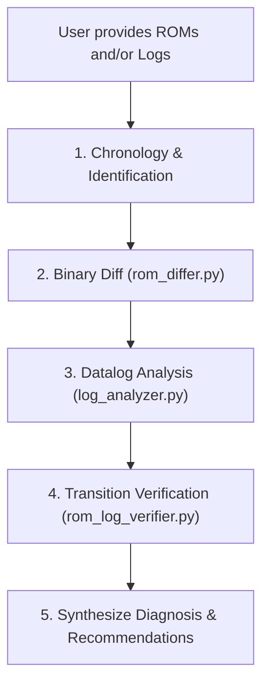

# Evo X Calibration & Telemetry Investigation Suite

A toolkit and knowledge base designed for analyzing Mitsubishi Lancer Evolution X (4B11T) calibration ROMs (`.srf` / `.bin`) and EvoScan datalogs (`.csv`). Built for automated agentic investigation and tuner workflows.

---

## 1. System Architecture & ECU Fundamentals

### Platform Specifications
- **Vehicle**: 2013 Mitsubishi Lancer Evolution X (USDM 5MT)
- **Engine**: 2.0L 4B11T (1,998 cc, 4-cylinder, 4-stroke)
- **ECU Model**: Renesas M32186F8 (M32R architecture)
- **Base ROM ID**: `59580004` (USDM 2013 5MT)
- **Patched ROM ID**: `59580304` (TephraMOD v3 + RAX Fast Logging)

### ROM File Structure & Memory Offsets
- **`.srf` Files**: EcuFlash Secure ROM Format contains a **328-byte (0x148)** metadata header. Table offsets in `.srf` files are:
  $$\text{File Offset} = 328 + \text{ROM Memory Address}$$
- **`.bin` Files**: Raw memory dump with 0-byte header ($\text{File Offset} = \text{ROM Address}$).

### Key Calibration Memory Addresses
| Table Name | Address | Dimensions | Scaling | Storage Type | Units |
| :--- | :---: | :---: | :---: | :---: | :---: |
| **MAF Scaling Horizontal** | `0x5757a` | 130 elements | `x / 100.0` | `uint16` (big-endian) | g/s |
| **MAF Volts Axis** | `0x61fd0` | 130 elements | `x * 5.0 / 1023.0` | `uint16` (big-endian) | V |
| **MAP Load Calc #1 (Hot)** | `0x608ae` | 20 MAP $\times$ 19 RPM | `(x * 10 / 512) * 10 / 32` | `uint16` (`swapxy="true"`) | Load % |
| **MAP Load Calc #2 (Cold)** | `0x605ac` | 20 MAP $\times$ 19 RPM | `(x * 10 / 512) * 10 / 32` | `uint16` (`swapxy="true"`) | Load % |
| **MAP Load Calc #3** | `0x602aa` | 20 MAP $\times$ 19 RPM | `(x * 10 / 512) * 10 / 32` | `uint16` (`swapxy="true"`) | Load % |
| **MAP Axis** | `0x6344a` | 20 elements | `((x * 2556 / 3800) + 0.5) / 2` | `uint16` (big-endian) | kPa |
| **RPM Axis** | `0x6341e` | 19 elements | `x * 1000 / 256` | `uint16` (big-endian) | RPM |
| **Open Loop Fuel Map #1** | `0x57508` | 16 Load $\times$ 19 RPM | `14.7 * 128 / x` | `uint8` | Target AFR |
| **ROM Checksum** | `0xbfff0` | 4 bytes | 32-bit CRC / mitsucan | `uint32` | Hex |

---

## 2. Load Calculation Physics & Math

### The MAF Load Transfer Function
For a 4-cylinder, 4-stroke engine, there are 2 intake strokes per crankshaft revolution. The cylinder air mass per stroke is:
$$m_{\text{cyl}} = \frac{30 \times MAF_{\text{g/s}}}{RPM} \quad (\text{grams})$$

For the 4B11T ($1,998\text{ cc}$), reference cylinder capacity at STP is $0.6014\text{ grams}$. Engine Load % is:
$$MAFCalcs = \frac{4988.4 \times MAF_{\text{g/s}}}{RPM}$$

**Empirical Verification**: Across 25,000+ log rows, the ratio $\frac{MAFCalcs \times RPM}{T_{\text{MAF}}(V)}$ evaluates to $4,964 \pm 20$ (within $0.5\%$ of theoretical physics).
**Key Takeaway**: At constant RPM and voltage, $MAFCalcs$ changes **100% linearly ($1:1$)** with changes to the `MAF Scaling Horizontal` table.

---

## 3. Tool Suite Guide

All tools are standalone CLI scripts written in Python 3 with **zero external dependencies** (using standard library `struct`, `csv`, `json`, `argparse`, `math`).

### 1. `rom_extractor.py`
Extracts and converts calibration tables directly from `.srf` or `.bin` ROMs.
```bash
# Extract MAF and MAP tables as formatted tables
python3 tools/rom_extractor.py "path/to/rom.srf"

# Output MAF table as TSV (ready for EcuFlash clipboard paste)
python3 tools/rom_extractor.py "path/to/rom.srf" --table maf --format tsv

# Output MAP based load table as JSON
python3 tools/rom_extractor.py "path/to/rom.srf" --table map --format json
```

### 2. `rom_differ.py`
Compares two ROM binaries and computes exact cell-by-cell deltas and multipliers ($C_{\text{MAF}}$ / $C_{\text{MAP}}$).
```bash
# Diff two ROMs (shows first 20 changed cells per table)
python3 tools/rom_differ.py "rom_v4.srf" "rom_v5.srf"

# Show all modified cells without truncation
python3 tools/rom_differ.py "rom_v4.srf" "rom_v5.srf" --all
```

### 3. `log_analyzer.py`
Evaluates an EvoScan datalog CSV for fuel error, load balance, knock, and regime stability.
```bash
# Analyze full datalog
python3 tools/log_analyzer.py "EvoScanDataLog.csv"

# Custom ECT / throttle filtering
python3 tools/log_analyzer.py "EvoScanDataLog.csv" --ect 80 --app 15

# Export stats as JSON for programmatic consumption
python3 tools/log_analyzer.py "EvoScanDataLog.csv" --json
```

### 4. `rom_log_verifier.py`
Verifies the predictive accuracy and response gain between two flashes and their matching logs.
```bash
python3 tools/rom_log_verifier.py "rom_v4.srf" "rom_v5.srf" "log_v4.csv" "log_v5.csv"
```

### 5. `balancer_simulator.py`
Simulates LogChopper's MAF & MAP Balancer algorithm on any ROM and log, allowing experimentation with enhancements.
```bash
# Standard simulation
python3 tools/balancer_simulator.py "rom.srf" "log.csv"

# Enable feed-forward prediction (eliminates moving target lag)
python3 tools/balancer_simulator.py "rom.srf" "log.csv" --feed-forward

# Enable soft sigmoid boundary blending (eliminates knife-edge chatter)
python3 tools/balancer_simulator.py "rom.srf" "log.csv" --soft-blend --damping 0.25
```

### 6. `m32r_inspector.py`
Inspects internal MCU interrupt vectors, traces cross-references to tables/RAM, and disassembles M32R firmware instructions with annotated symbol names.
```bash
# Dump MCU vector table (Interrupts, ADC, Timers, CAN Bus)
python3 tools/m32r_inspector.py vectors "path/to/rom.hex.bin"

# Find all code routines referencing a calibration table (e.g. MAF Scaling 0x5757A)
python3 tools/m32r_inspector.py xref 0x5757A "path/to/rom.hex.bin"

# Disassemble a range of instructions in the ROM
python3 tools/m32r_inspector.py disasm 0x0FB060 "path/to/rom.hex.bin" -n 20
```

### 7. `export_ghidra_symbols.py`
Parses all EcuFlash XML definitions (`evo10base.xml`, `59580004.xml`, `RAX`, `TephraMOD`) and generates symbol maps for reverse engineering.
```bash
python3 tools/export_ghidra_symbols.py
```
Outputs:
- `references/GhidraImportEvo10Symbols.java` (Native Ghidra script to auto-label all 402+ tables and memory locations)
- `references/evo10_symbols.csv` (CSV symbol table for scripts and CLI disassemblers)

### 8. `scan_rom_tables.py`
Scans the entire ROM for 2D and 3D table metadata descriptors, identifies input sensor axes (RPM, Load, ECT, TPS, IAT), detects all unmapped tables, and exports an EcuFlash XML extension.
```bash
python3 tools/scan_rom_tables.py "path/to/rom.hex.bin"
```
Output:
- `references/discovered_unmapped_tables.xml` (EcuFlash XML extension defining 399 newly discovered maps)

### 9. `decompile_ecu.py`
Batch decompiles ECU machine code into clean, readable C source code using Ghidra's headless decompiler engine.
```bash
# Decompile all core engine subsystems (Fuel, Interpolation, MIVEC, TephraMOD) to C
python3 tools/decompile_ecu.py "path/to/rom.hex.bin"

# Decompile a specific function address to C
python3 tools/decompile_ecu.py "path/to/rom.hex.bin" --func 0x022A80 --name fuel_calc
```
Decompiled C source files are saved to `decompiled_c/`:
- `fuel_calculate_pulse_width.c`: Fuel injection pulse width & target AFR pipeline
- `table_interpolate_2d_and_3d.c`: Core 2D and 3D bilinear surface interpolator
- `tephramod_v3_map_dispatcher.c`: Live tuning map selector and memory structure
- `coolant_temp_axis_evaluator.c`: Coolant temperature axis binary search & lookup


---

## 4. Decompilation & Reverse Engineering with Ghidra

The Mitsubishi Lancer Evolution X uses a **Renesas M32186F8** microcontroller running the **M32R (32-bit RISC)** instruction set.

### Installed Reverse Engineering Environment:
- **Ghidra**: Software Reverse Engineering Suite (installed at `/opt/homebrew/bin/ghidraRun`)
- **JDK 21**: OpenJDK 21 runtime (`/opt/homebrew/opt/openjdk@21`)
- **M32R Processor Module**: Compiled and installed in Ghidra (`m32r:2:default`) with full MCU register mapping, peripherals, and interrupt vectors.

### Workflow to Reverse Engineer Any Evo X ROM in Ghidra:
1. **Launch Ghidra**:
   ```bash
   ghidraRun
   ```
2. **Create or Open a Project** (`File -> New Project`).
3. **Import ROM**:
   - Select raw `.hex.bin` file (or `.srf` stripped of its 328-byte header).
   - In the Import Options window:
     - **Format**: Raw Binary
     - **Language**: `M32R:default:32:default` (`M32R`)
     - **Base Address**: `0x00000000` (or leave default `0`)
4. **Auto-Label 402+ Calibration Tables**:
   - Open the ROM in CodeBrowser.
   - Go to `Window -> Script Manager`.
   - Add script directory: `.../Evoman/tuning_tools/references`.
   - Select `GhidraImportEvo10Symbols.java` and click **Run**.
   - All fuel tables, MAF curves, boost PID parameters, and RAM locations will instantly be labeled in both the Disassembly and Decompiler views!

---

## 5. Agentic LLM Workflow Protocol

When tasked with investigating ROMs or datalogs in future pairing sessions, follow this step-by-step protocol:



1. **Chronology & Identification**:
   - Sort ROMs and logs by modification timestamp.
   - Map each log to the ROM that preceded it.
2. **Binary Diff**:
   - Run `tools/rom_differ.py` to identify exactly which cells and tables were modified.
   - Record the table factors ($C_{\text{MAF}}$).
3. **Datalog Analysis**:
   - Run `tools/log_analyzer.py` on each log.
   - Inspect:
     - Median AFR error (target is 1.0000)
     - Steady Idle AFR (target is 14.70)
     - Steady Cruise AFR (target is 14.70)
     - MAP/MAF ratio vs target curve (target is 1.05 at $\le 80\text{ kPa}$, 0.95 at $\ge 120\text{ kPa}$)
     - Inverted state ratio ($MAF < MAP$ vs $MAP < MAF$)
4. **Transition Verification**:
   - Run `tools/rom_log_verifier.py` across the transition.
   - Check if $MAFCalcs$ changed as predicted by $C_{\text{MAF}}$ and evaluate the empirical response gain.
5. **Synthesize Findings**:
   - Determine if the vehicle is running better, worse, or indecisive based on steady-state convergence.

